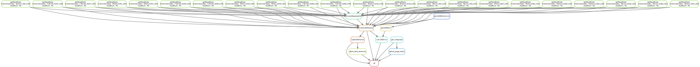

```{css echo = FALSE}
/* ############
# CONTAINER CSS
############ */

.author, .subtitle{
  display: none;
} 

.date{
  color: yellow;
} 
.main-container {
  max-width: 80%;
  background-color: black;
  color: white;
  padding: 3% 3% 3% 3%;
  margin-left: auto;
  margin-right: auto;
}
body{
  font-size: 14px;
  text-align: left;
}

#header {
  background-color: none;
  color: white;
  /* line-height: 4; */
  font-family: "Montserrat", sans-serif;
  text-align: center;
  width: 100%;
  padding: 5%;
  text-transform: none;
  font-weight: bold;
  background-image: url("images/bkgd.png");
  background-repeat: no-repeat;
  height: 100%; /* You must set a specified height */
  background-position: center; /* Center the image */
  background-size: cover; /* Resize the background image to cover the entire container */
  
}
```

```{css echo = FALSE} 
/* ############
# BODY CSS
############ */
#header h1{
  font-size: 4em;
  text-transform: capitalize;
  color: black;
}
#header h2{
  font-size: 2.8em;
}

#header h3{
  font-size: 1.8em;
  color: black;
  text-transform: capitalize;
} 
#header img{
width:96%;
}

body {
  background-color: F5F5F5;
  color: white;
  font-family: "Montserrat", sans-serif;
}
body h1{
  font-size: 2.8em;
  text-transform: capitalize;
}
body h2{
  font-size: 2.0em;
}

body h3{
  font-size: 1.6em;
}

table tbody tr td {
  font-size: 14px;
  text-transform: capitalize;
}
body img{
  width: 100%;
  display: block;
  margin-left: auto;
  margin-right: auto;
  padding: 20px, 50px, 20px, 50px;
}
blockquote {
    padding: 10px 20px;
    margin: 0 0 20px;
    font-size: 16px;
    border-left: 5px solid #eee;
}
#glimpse{
  text-align: left;
  background-color: black;
  color: rgb(127, 202, 106);
}

#glimpse h1{
  text-transform: none;
}

a{
  color: #6bb7f5;
}
#tablefield {
  max-width: 80%;
  margin-left: auto;
  margin-right: auto;
}
hr {
  display: inline-block;
  text-align: left;
  margin: 0px;
}
#glimpse hr {
  display: inline-block;
  margin: 0px;
  text-align: left;
}

#appendix img{
  width: 75%;
}

.DiagrammeR {
  background: auto;
}
.DiagrammeR img{
  width: 100%;
  display: block;
  margin-left: auto;
  margin-right: auto;
  text-align: center;
  width: 1201.75px
}
```


```{css echo = FALSE} 
/* ############
# MEDIA: max-width: 768px
############ */
@media only screen and (max-width: 768px) {
  .main-container {
  max-width: 100%;
  padding: 1% 1% 1% 1%;
  margin-left: auto;
  margin-right: auto;
  }
  #header h1{
    font-size: 3em;
    text-transform: capitalize;
    color: black;
  }

   body {
    font-size: 12px;
    width: 100%; 
  } 
  #footer {
    text-align: left;
    font-size: 1.1em;
  } 

  #tablefield {
  width: 100%;
  margin-left: auto;
  margin-right: auto;
} 
body h1{
  font-size: 2.5em;
  text-transform: capitalize;
}
body h2{
  font-size: 1.8em;
}

body h3{
  font-size: 1.6em;
}

#tablefield h2{
  font-size: 1.6em;
}

```


<link rel="preconnect" href="https://fonts.googleapis.com">
<link rel="preconnect" href="https://fonts.gstatic.com" crossorigin>
<link href="https://fonts.googleapis.com/css2?family=Montserrat&display=swap" rel="stylesheet">


```{r echo=FALSE, message=FALSE, warning=FALSE}
knitr::opts_chunk$set(
  echo = FALSE,
  message = FALSE,
  warning = FALSE,
  cache = FALSE,
  comment = NA,
  fig.path='./figures/',
  fig.show='asis',
  dev = 'png',
  fig.align='center',
  out.width = "70%",
  fig.width = 7,
  fig.asp = 0.7,
  fig.show = "asis"
)

library(tidyverse, suppressPackageStartupMessages())
library(mikropml)
library(schtools)

```

<br>

## Quick glimpse {#glimpse}
- We use the snakemake workflow engine [@Koster2021] to maintain reproducibility in technical validation, regeneration of results, and improvement of the microbiome bioinformatics analysis.
- We review existing workflows to gain a better insights and regenerate contiguous but related rules.
- Each major step form a separate executable snakemake rule.

<br>

> We envision to keep fostering on continuous integration and development of highly reproducible workflows.

# General Framework
```{r}
library(DiagrammeR)
library(DiagrammeRsvg)

mermaid("graph TB

subgraph  

A[<b>MICROBIOME DATA ANALYSIS</b>] --> B{Basic Requirements}
B --> C[Basic Software]
B --> D[Sample Metadata]
B --> E[Sequencing Data]
B --> F[Reference Database]
B --> J[Mapping Files]
C --> G[Analysis & Visualization Tools]
C --> H[Quality Control Tools]
C --> I[Bioinformatics Pipelines]
F --> K[Sequence Alignments]
F --> L[Taxonomy Classifiers]

end

", width = 1201.75)


```
<hr width=100%><br><br>

# IMAP-Mothur Snakemake workflow 
- A mothur-based workflow for microbial profiling using 16S rRNA gene markers.
- Each major step forms a separate executable snakemake rule.
- GitHub repo: https://github.com/tmbuza/imap-mothur


<br><br>

## Current snakemake rule graph<br>


<br><br>
<br><br>

## Current snakemake dag<br>


<br><br>

```{r child='workflow/scripts/smk_mermaid_dag.Rmd'}
```

<br><br>

## Microbial profiling classification options
### 1. Operational Taxonomic Units (OTUs)
- OTUs are clusters of similar sequences and are commonly accepted as analytical units in microbial profiling when using 16S rRNA gene markers.

### 2. Phylotype
- A phylotype in microbiome research is a DNA sequence or group of sequences sharing more than an arbitrarily chosen level of similarity of a 16S rRNA gene marker.

### 3. Amplicon Sequence Variant (ASV)
- An ASV in microbiome research is any inferred single DNA sequences recovered from a bioinformatics analysis of 16S rRNA marker genes.

### 4. Microbial Phylogenies
- Microbial phylogenies are from gene sequence homologies.  Models of mutation determine the most-likely evolutionary histories.

<br><br><hr width=50%>

# Appendix {-}
## Reference Databases
<ol>
  <li>Mothur-based SILVA reference files [@MothurSILVA].</li>
  <li>Mothur-based RDP reference files [@MothurRDP]. Note: The RDP database is to classify 16S rRNA gene sequences to the genus level.</li>
  <li>ZymoBIOMICS Microbial Community Standard (Cat # D6306)[@Zymo2023]. The ZymoBIOMICS Microbial Community DNA Standard is designed to assess bias, errors and other artifacts after the step of nucleic acid purification.</li>
</ol>

<br>
<br>

## Sample location (demo)


<br>
<br>

## Troubleshooting (in progress)
<ol>
  <li>Mothur dist.seqs taking too long.</li>
  <ul>
    <li>Merged reads are too long, probably over 300pb.</li>
    <li>Reads not overlaping when merging the paired reads.</li>
    <li>Too many uniques representative sequences probably caused by lack of overlapping.</li>
    <li>No enough computer power which suggest a use of HPC or Cluster.</li>
  </ul>
</ol>

<br>
<br>

## References
::: {#refs}
:::

<br><br><hr width=50%><br>

<div id="footer">
Last updated on `r format(Sys.time(), '%B %d, %Y')`. <br><br>
These workflows are continuously reviewed, integrated, tested and compiled by [`r rmarkdown::metadata$author`](mailto:`r rmarkdown::metadata$email_address`).  
Github_Repo: `r rmarkdown::metadata$github_repo`.  
Github_Page (this document): `r rmarkdown::metadata$github_page`.  
Visit the [Complex Data Insights (CDI) website](`r rmarkdown::metadata$related_website`) for more practical user guides (...in progress).  
</div><br><br>
