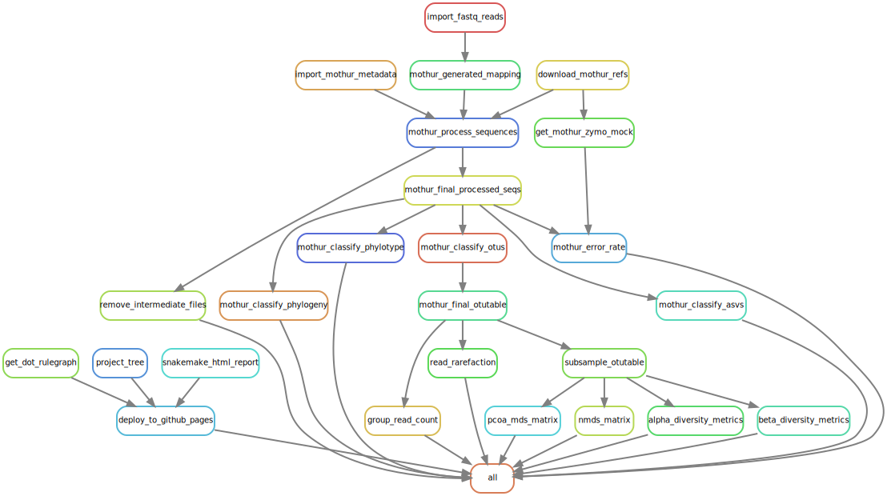

<br><br>

<link rel="preconnect" href="https://fonts.googleapis.com">
<link rel="preconnect" href="https://fonts.gstatic.com" crossorigin>
<link href="https://fonts.googleapis.com/css2?family=Montserrat&display=swap" rel="stylesheet">


```{r echo = FALSE, message = FALSE}
library(tidyverse)
library(lubridate)
```

```{css echo = FALSE}
.author {
  display: none;
} 
.main-container {
  max-width: 80%;
  background-color: black;
  color: white;
  padding: 3% 3% 3% 3%;
  margin-left: auto;
  margin-right: auto;
}
body{
  font-size: 14px;
  text-align: left;
}
@media only screen and (max-width: 768px) {
  .main-container {
  max-width: 100%;
  background-color: black;
  color: white;
  padding: 1% 1% 1% 1%;
  margin-left: auto;
  margin-right: auto;

  }
   body {
    font-size: 12px;
    width: 100%;
  }
  #header h1{
    font-size: 2.2em;  
  }
  #glimpse h1{
    font-size: 3.0em;
  } 
  #glimpse p{
    font-size: 1.5em;
  } 
  #footer {
    text-align: left;
    font-size: 1.1em;
  } 
  #header h3{
    font-size: 1.8em;
  }
  #header img{
  max-width:80%;
  }
  #tablefield {
  width: 100%;
  margin-left: auto;
  margin-right: auto;
} 
body h1{
  font-size: 1.8em;
  text-transform: capitalize;
}
body h2{
  font-size: 1.6em;
}

body h3{
  font-size: 1.6em;
}

#tablefield h2{
  font-size: 1.6em;
}
}

#header {
  background-color: #013011;
  color: #f5f5f5;
  font-family: "Montserrat", sans-serif;
  text-align: center;
  width: 100%;
  padding: 5% 0% 0% 0%;
  text-transform: none;
}
#header h3, #glimpse h1{
  color: #b5f56b;
}

#header h1{
  font-size: 3.5em;
}

#header h3{
  font-size: 2.0em;
}
#header img{
width:70%;
}

body {
  background-color: F5F5F5;
  color: white;
  font-family: "Montserrat", sans-serif;
}
body h1{
  font-size: 2.5em;
  text-transform: capitalize;
}
body h2{
  font-size: 2.0em;
}

body h3{
  font-size: 1.6em;
}

table tbody tr td {
  font-size: 14px;
  text-transform: capitalize;
}
body img{
  width: 100%;
  display: block;
  margin-left: auto;
  margin-right: auto;
  padding: 20px, 50px, 20px, 50px;
}
#glimpse{
  text-align: center;
}

#glimpse h1{
  text-transform: none;
}

a{
  color: #6bb7f5;
}
#tablefield {
  max-width: 80%;
  margin-left: auto;
  margin-right: auto;
}   
```

# General overview of `mothur` pipeline
<!--  -->


# Useful links


<br><br><hr>

<div id="footer">
Last updated on `r format(Sys.time(), '%B %d, %Y')`.  
These workflows have been reviewed, tested and compiled by [TMBuza](mailto:`r rmarkdown::metadata$email_address`).  
For more workflows, visit the [CDI website](`r rmarkdown::metadata$website`) (...in progress).  
</div>